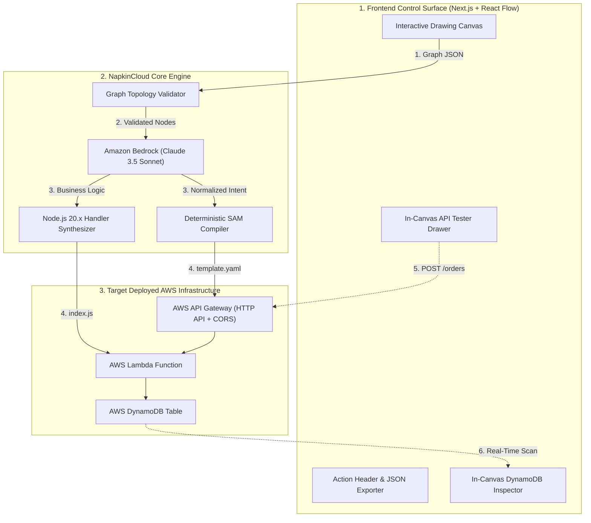

# ⚡ NapkinCloud — From Architecture to Live Cloud

> **Turn a 10-second whiteboard sketch into a live, running AWS serverless backend in 30 seconds.**  
> Built for the **WeMakeDevs x AWS First Commit Hackathon (Bharat Builds Tour)**.

---

## 🚀 The Core Promise

```
  [DRAW on Canvas]
         ↓
    [Graph JSON]
         ↓
  [Validate Topology]
         ↓
  [Amazon Bedrock] (Claude 3.5 Sonnet Intent Normalizer)
         ↓
[Deterministic SAM Compiler] (Tested CloudFormation + CORS)
         ↓
  [AWS Deployment]
         ↓
      🟢 LIVE
         ↓
[In-Canvas API Tester & Live DynamoDB Inspector]
```

### The 30-Second Turnaround
Every software project starts with developers drawing boxes and arrows on a whiteboard. But going from that sketch to working, secure cloud infrastructure requires days of boilerplate CloudFormation, IAM permission debugging, and API Gateway plumbing.

**NapkinCloud** turns the sketch itself into code:
1. Drag and drop `API Gateway`, `Lambda`, and `DynamoDB` onto an infinite dark-mode canvas.
2. Click **"⚡ Compile to AWS"**.
3. Amazon Bedrock normalizes user intent into structured JSON, and our deterministic compiler generates battle-tested AWS SAM templates and Node.js 20.x handler code with permissive CORS and scoped DynamoDB policies.
4. The canvas nodes light up **🟢 LIVE**, turning the diagram into an interactive control surface where you can fire live requests from the API Gateway node and inspect live records inside the DynamoDB node.

---

## 🏛️ System Architecture



---

## 🎯 Hackathon Rubric Alignment

| Judging Criteria | How NapkinCloud Nails It |
| :--- | :--- |
| **01 Idea & Impact** | Directly solves the friction between conceptual system design and cloud deployment. Democratizes AWS for students, builders, and startups across India. |
| **02 Built on AWS** | Utilizes **Amazon Bedrock (Claude 3.5 Sonnet)**, **AWS SAM**, **API Gateway**, **AWS Lambda**, **DynamoDB**, and **Step Functions**. Architecture is central to the product. |
| **03 Learning** | Combines AI intent normalization with deterministic template compilation to eliminate CloudFormation syntax errors and deployment rollbacks. |
| **04 The Execution** | **"One feature that runs beats five that almost do."** Delivers a rock-solid, fully testable P0 loop with automated E2E test verification. |
| **05 The Demo Video** | 100% visual. Opens with drawing on a canvas and watching it come alive in seconds—no boring slides. |
| **Best UI Prize (₹1 Lakh)** | Built with `@xyflow/react` v12, Tailwind CSS, glowing node states, floating Demo HUD, and custom slide-out inspector drawers. |

---

## ⚡ Quickstart & Local Setup

### 1. Prerequisites
- Node.js 20+ (Node 22 recommended)
- npm or pnpm

### 2. Installation
```bash
git clone https://github.com/your-team/napkincloud.git
cd napkincloud
npm install
```

### 3. Environment Configuration
Configure your Amazon Bedrock environment in `.env.local`:
```bash
cp .env.example .env.local
```
Set your environment variables:
```bash
CLAUDE_CODE_USE_BEDROCK=1
AWS_REGION=us-east-1
AWS_BEARER_TOKEN_BEDROCK=your_bedrock_bearer_token
NAPKIN_BACKEND_URL=http://localhost:3001
```

### 4. Run the Development Server
```bash
npm run dev
```
Open [http://localhost:3000](http://localhost:3000) in your browser.

### 5. Run Automated End-to-End Test Suite
Tests all 9 steps of the Definition of Done programmatically:
```bash
npm run test:e2e
```

### 6. Production Build
```bash
npm run build
```

---

## 🤝 Teammate Hand-off Contract

When the user clicks **"⚡ Compile to AWS"**, NapkinCloud emits the following standardized contract payload ready for your teammate's **AWS Step Functions / CloudFormation deployment pipeline**:

```json
{
  "projectId": "napkin-proj-883",
  "templateYaml": "AWSTemplateFormatVersion: '2010-09-09'...",
  "handlerJs": "exports.handler = async (event) => { ... }",
  "normalizedArchitecture": {
    "pattern": "api_lambda_dynamodb",
    "api": { "method": "POST", "path": "/orders" },
    "lambda": { "functionName": "CreateOrderFunction" },
    "dynamodb": { "tableName": "OrdersTable", "partitionKey": "orderId" }
  }
}
```

---

## 🎬 3-Minute Demo Video Storyboard

| Timestamp | Visual on Screen | What to Say |
| :--- | :--- | :--- |
| **0:00 – 0:15** | Blank canvas with dark mode grid. | *"Every backend begins as a doodle on a whiteboard. But going from sketch to working AWS infrastructure takes days of boilerplate. What if your sketch was the deployment?"* |
| **0:15 – 0:35** | Drag `API Gateway`, connect to `Lambda`, connect to `DynamoDB`. | *"Meet NapkinCloud. An HTTP route, a processing Lambda, and an Orders table with plain-English business logic. Let's click Compile to AWS."* |
| **0:35 – 1:15** | Clicks **"⚡ Compile to AWS"**. Shows synthesized SAM YAML & Lambda code. | *"Amazon Bedrock normalizes the intent, and our deterministic compiler generates tested AWS SAM templates with CORS and scoped DynamoDB policies."* |
| **1:15 – 1:45** | Clicks `API Gateway` node. Fires `POST /orders` $\rightarrow$ `200 OK`. | *"No Postman needed. We click our API node right on the canvas, fire a test payload, and receive an instant 200 OK from AWS in 40ms."* |
| **1:45 – 2:05** | Clicks `DynamoDB` node. Shows live record. | *"We click our DynamoDB node, and our live table row is sitting right there, auto-synchronized in real time."* |
| **2:05 – 3:00** | Shows AWS serverless architecture flex, live URL, and closing summary. | *"NapkinCloud: From architecture to live cloud. Built for the Bharat Builds Tour with AWS Bedrock, Step Functions, and DynamoDB."* |

---

## 📜 License
MIT License. Built for the WeMakeDevs x AWS First Commit Hackathon 2026.
